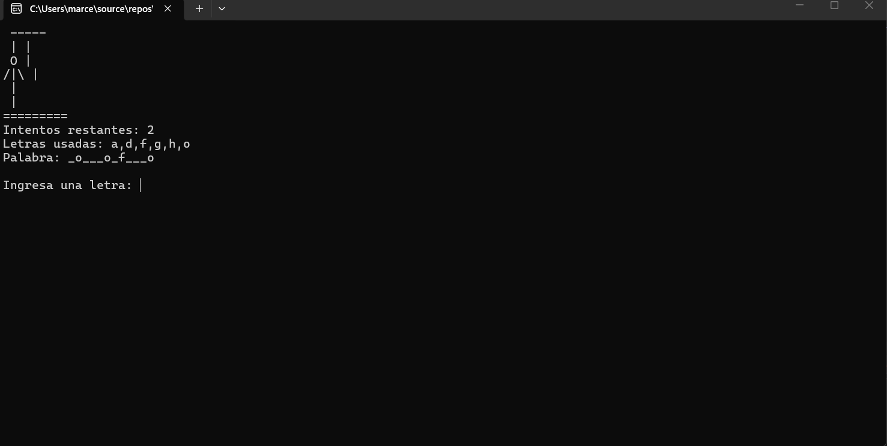

# Juego del Ahorcado

## Descripción

Este proyecto consiste en una versión del clásico juego “Ahorcado” desarrollada en C# utilizando una aplicación de consola. El jugador debe descubrir una palabra oculta ingresando letras desde el teclado antes de quedarse sin oportunidades.

El sistema muestra el progreso del jugador en tiempo real, registra las letras utilizadas y dibuja visualmente el avance del ahorcado conforme se cometen errores.

---

# Características principales

- Selección aleatoria de palabras.
- Control de intentos fallidos.
- Registro de letras usadas.
- Validación de entradas repetidas.
- Dibujo dinámico del ahorcado.
- Reinicio automático de partidas.
- Interfaz simple e intuitiva en consola.

---

# Estructura del proyecto

El proyecto fue organizado utilizando múltiples clases para separar responsabilidades y mejorar la claridad del código.

Se aplicaron conceptos como:

- Programación Orientada a Objetos.
- Encapsulamiento.
- Modularización.
- Validaciones.
- Manejo de listas y ciclos.
- Separación entre lógica y visualización.

---

# Funcionamiento

1. El sistema selecciona una palabra aleatoria.
2. El jugador introduce letras desde el teclado.
3. Si la letra pertenece a la palabra:
   - se revela en pantalla.
4. Si la letra es incorrecta:
   - el jugador pierde un intento.
5. El juego termina al:
   - descubrir toda la palabra, o
   - completar el dibujo del ahorcado.

## Captura del juego

---

# Tecnologías utilizadas

- C#
- .NET
- Visual Studio
- Aplicación de Consola

---

Cláusula de IA
Este proyecto utilizó herramientas de inteligencia artificial como apoyo durante el desarrollo para:

resolver dudas técnicas
mejorar la interfaz visual
detectar errores
